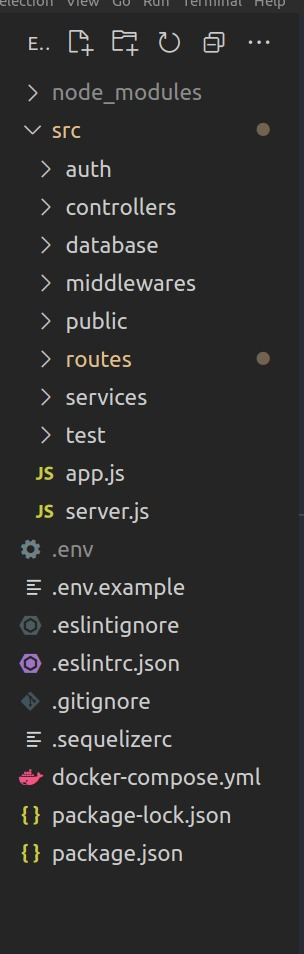
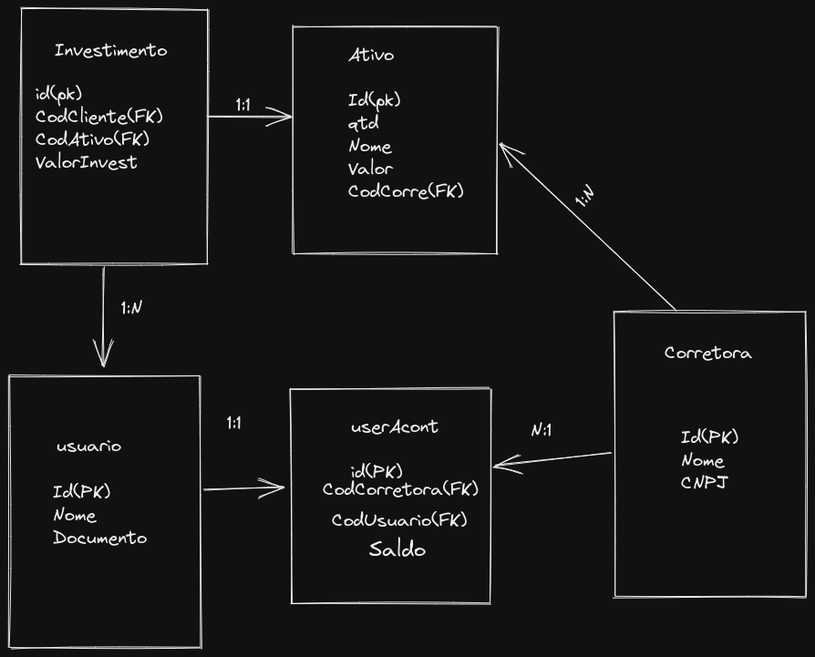

## Olá seja bem-vindo(a) ao desafio prático da [XP](https://www.xpi.com.br/) :rocket:

Este projeto consiste em uma API no padrão rest que faz uma requisição para um banco de dados retornando alguns endpoints solicitados.

O desfio proposto faz parte do desafio técnico da XP. Vem comigo que este projeto ficou da hora :alarm_clock:

## Estrutura

Procurei implementar uma arquitetura na API, estou sempre pensando em escalabilidade e organização.
A aquitetura pensada foi a **`MSC`**.

## Estrutura do Banco

**`MSC`** - MODEL, SERVICES e CONTROLLERS

- #### API

1. Pasta Controllers se dedica apenas para receber requisições e repassar para camada de services, receber sua resposta e repassar para rota da aplicação.

2. Pasta de middlewares ficam os middlewares, neste projeto possui 1 middleware para validação do JWT.

3. Pasta routers contém as rotas da aplicação.

4. Pasta services se dedica a receber requisiçoes da camada de controllers, aplicar regras
de negócio e a lógica necessária e devolver uma resposta ao controllers.

5. Pasta auth contém a função para gerar o token JWT.

## Tecnologias utilizadas

- Linguagens:
    - NodeJs
- ORM(Object/Relational Mapper): 
    - Sequelize
- Autenticação:
    - JWT
- Configurações / variáveis de ambiente
    - Dotenv
- docker-compose:
    - image: Mysql:8.0.21
    - image: Node:16
- Organização e Padronização de codigo:
    - Eslint / config-airbnb-base
- Facilitador de desenvolvimento:
    - nodemon
- framework's:
    - Express
- Testes:
    - mocha
    - chai
    - sinon

## Começando

- Rode o comando **docker-compose up -d**
- Entre no container com o comando **docker exec -ti desafioXP bash**
- Rode o comando **npm install** para instalar as depedências do projeto.
- Rode o comando **npx sequelize db:create** (Para criar o Bando de dados)
- Rode o comando **npx sequelize db:migrate** (Para criar as Tabelas)
- Rode o comando **npx sequelize db:seed:all** (Para criar Criar alguns dados nas tabelas)
- Rode o comando **npm run dev** dentro do container para subir o servidor.

#### Próximos passos

#### Para executar o projeto, poderá acessar no seu navegador web a rota /docs referente a documentação do Swagger

exemplo: localhost:3000/docs

## Outros comandos

Verifique o `package.json`, lá se encontram scripts para execução do projeto.

- `"dev": "nodemon src/server.js"` inicia o projeto com nodemon.
- `"test": "mocha src/test/**/*.test.js --exit"` Executa os testes.

### Vou ficando por aqui, muito obrigado pela atenção e até breve!